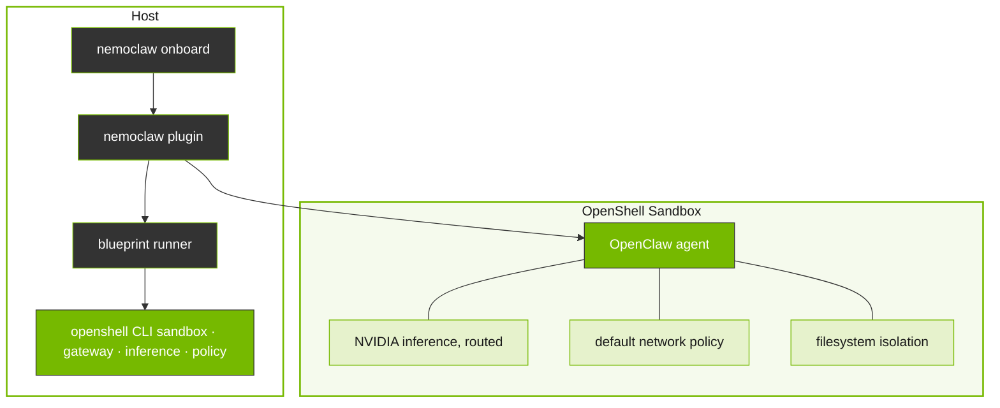

# Nemoclaw Overview

Learn how NemoClaw combines a lightweight CLI plugin with a versioned blueprint to move OpenClaw into a controlled sandbox.

## Context

NemoClaw combines a lightweight CLI plugin with a versioned blueprint to move OpenClaw into a controlled sandbox.
This page explains the key concepts about NemoClaw at a high level.

## How It Fits Together

The `nemoclaw` CLI is the primary entrypoint for setting up and managing sandboxed OpenClaw agents.
It delegates heavy lifting to a versioned blueprint, a Python artifact that orchestrates sandbox creation, policy application, and inference provider setup through the OpenShell CLI.

## Design Principles

NemoClaw architecture follows the following principles.

Thin plugin, versioned blueprint
: The plugin stays small and stable. Orchestration logic lives in the blueprint and evolves on its own release cadence.

Respect CLI boundaries
: The `nemoclaw` CLI is the primary interface for sandbox management.

Supply chain safety
: Blueprint artifacts are immutable, versioned, and digest-verified before execution.

*Full details in `references/how-it-works.md`.*

> **Alpha software:** NemoClaw is in alpha, available as an early preview since March 16, 2026.
> APIs, configuration schemas, and runtime behavior are subject to breaking changes between releases.
> Do not use this software in production environments.
> File issues and feedback through the GitHub repository as the project continues to stabilize.

NVIDIA NemoClaw is an open source reference stack that simplifies running [OpenClaw](https://openclaw.ai) always-on assistants.
It incorporates policy-based privacy and security guardrails, giving users control over their agents’ behavior and data handling.
This enables self-evolving claws to run more safely in clouds, on prem, RTX PCs and DGX Spark.

NemoClaw uses open source models, such as [NVIDIA Nemotron](https://build.nvidia.com), alongside the [NVIDIA OpenShell](https://github.com/NVIDIA/OpenShell) runtime, part of the NVIDIA Agent Toolkit—a secure environment designed for executing claws more safely.
By combining powerful open source models with built-in safety measures, NemoClaw simplifies and secures AI agent deployment.

| Capability              | Description                                                                                                                                          |
|-------------------------|------------------------------------------------------------------------------------------------------------------------------------------------------|
| Sandbox OpenClaw        | Creates an OpenShell sandbox pre-configured for OpenClaw, with filesystem and network policies applied from the first boot.                   |
| Route inference         | Configures OpenShell inference routing so agent traffic flows through cloud-hosted Nemotron 3 Super 120B via [build.nvidia.com](https://build.nvidia.com). |
| Manage the lifecycle    | Handles blueprint versioning, digest verification, and sandbox setup.                                                                                |

## Challenge

Autonomous AI agents like OpenClaw can make arbitrary network requests, access the host filesystem, and call any inference endpoint. Without guardrails, this creates security, cost, and compliance risks that grow as agents run unattended.

## Benefits

NemoClaw provides the following benefits.

| Benefit                    | Description                                                                                                            |
|----------------------------|------------------------------------------------------------------------------------------------------------------------|
| Sandboxed execution        | Every agent runs inside an OpenShell sandbox with Landlock, seccomp, and network namespace isolation. No access is granted by default. |
| NVIDIA Endpoint inference     | Agent traffic routes through cloud-hosted Nemotron 3 Super 120B via [build.nvidia.com](https://build.nvidia.com), transparent to the agent.          |
| Declarative network policy | Egress rules are defined in YAML. Unknown hosts are blocked and surfaced to the operator for approval.                 |
| Single CLI                 | The `nemoclaw` command orchestrates the full stack: gateway, sandbox, inference provider, and network policy.           |
| Blueprint lifecycle        | Versioned blueprints handle sandbox creation, digest verification, and reproducible setup.                             |

## Use Cases

You can use NemoClaw for various use cases including the following.

| Use Case                  | Description                                                                                  |
|---------------------------|----------------------------------------------------------------------------------------------|
| Always-on assistant       | Run an OpenClaw assistant with controlled network access and operator-approved egress.        |
| Sandboxed testing         | Test agent behavior in a locked-down environment before granting broader permissions.         |
| Remote GPU deployment     | Deploy a sandboxed agent to a remote GPU instance for persistent operation.                   |

## Reference

- [NemoClaw Release Notes](references/release-notes.md)

## Related Skills

- `nemoclaw-get-started` — Quickstart to install NemoClaw and run your first agent
- `nemoclaw-configure-inference` — Switch Inference Providers to configure the inference provider
- `nemoclaw-manage-policy` — Approve or Deny Network Requests to manage egress approvals
- `nemoclaw-deploy-remote` — Deploy to a Remote GPU Instance for persistent operation
- `nemoclaw-monitor-sandbox` — Monitor Sandbox Activity to observe agent behavior
