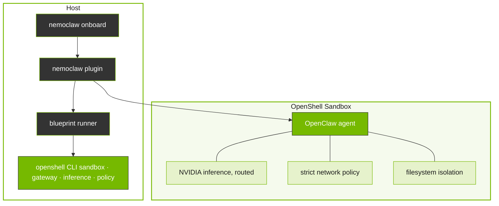

{/* SPDX-FileCopyrightText: Copyright (c) 2025-2026 NVIDIA CORPORATION & AFFILIATES. All rights reserved.
  SPDX-License-Identifier: Apache-2.0 */}

# How NemoClaw Works

NemoClaw combines a lightweight CLI plugin with a versioned blueprint to move OpenClaw into a controlled sandbox.
This page explains the key concepts at a high level.

## How It Fits Together

The `nemoclaw` CLI is the primary entrypoint for setting up and managing sandboxed OpenClaw agents.
It delegates heavy lifting to a versioned blueprint, a Python artifact that orchestrates sandbox creation, policy application, and inference provider setup through the OpenShell CLI.

## Design Principles

NemoClaw architecture follows the following principles.

Thin plugin, versioned blueprint
: The plugin stays small and stable. Orchestration logic lives in the blueprint and evolves on its own release cadence.

Respect CLI boundaries
: The `nemoclaw` CLI is the primary interface. Plugin commands are available under `openclaw nemoclaw` but do not override built-in OpenClaw commands.

Supply chain safety
: Blueprint artifacts are immutable, versioned, and digest-verified before execution.

OpenShell-native for new installs
: For users without an existing OpenClaw installation, NemoClaw recommends `openshell sandbox create` directly
  rather than forcing a plugin-driven bootstrap.

Reproducible setup
: Running setup again recreates the sandbox from the same blueprint and policy definitions.

## Plugin and Blueprint

NemoClaw is split into two parts:

- The *plugin* is a TypeScript package that powers the `nemoclaw` CLI and also registers commands under `openclaw nemoclaw`.
  It handles user interaction and delegates orchestration work to the blueprint.
- The *blueprint* is a versioned Python artifact that contains all the logic for creating sandboxes, applying policies, and configuring inference.
  The plugin resolves, verifies, and executes the blueprint as a subprocess.

This separation keeps the plugin small and stable while allowing the blueprint to evolve on its own release cadence.

## Sandbox Creation

When you run `nemoclaw onboard`, NemoClaw creates an OpenShell sandbox that runs OpenClaw in an isolated container.
The blueprint orchestrates this process through the OpenShell CLI:

1. The plugin downloads the blueprint artifact, checks version compatibility, and verifies the digest.
2. The blueprint determines which OpenShell resources to create or update, such as the gateway, inference providers, sandbox, and network policy.
3. The blueprint calls OpenShell CLI commands to create the sandbox and configure each resource.

After the sandbox starts, the agent runs inside it with all network, filesystem, and inference controls in place.

## Inference Routing

Inference requests from the agent never leave the sandbox directly.
OpenShell intercepts every inference call and routes it to the configured provider.
NemoClaw routes inference to NVIDIA cloud, specifically Nemotron 3 Super 120B through [build.nvidia.com](https://build.nvidia.com). You can switch models at runtime without restarting the sandbox.

## Network and Filesystem Policy

The sandbox starts with a strict baseline policy defined in `openclaw-sandbox.yaml`.
This policy controls which network endpoints the agent can reach and which filesystem paths it can access.

- For network, only endpoints listed in the policy are allowed.
  When the agent tries to reach an unlisted host, OpenShell blocks the request and surfaces it in the TUI for operator approval.
- For filesystem, the agent can write to `/sandbox` and `/tmp`.
  All other system paths are read-only.

Approved endpoints persist for the current session but are not saved to the baseline policy file.

## Next Steps

- Follow the [NemoClaw Quickstart — Install, Launch, and Run Your First Agent](/get-started/quickstart) to launch your first sandbox.
- Refer to the [NemoClaw Architecture — Plugin, Blueprint, and Sandbox Structure](/reference/architecture) for the full technical structure, including file layouts and the blueprint lifecycle.
- Refer to [NemoClaw Inference Profiles — NVIDIA Cloud](/reference/inference-profiles) for detailed provider configuration.
