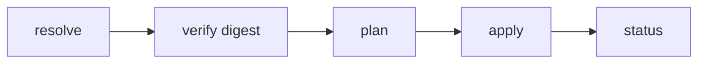

{/* SPDX-FileCopyrightText: Copyright (c) 2025-2026 NVIDIA CORPORATION & AFFILIATES. All rights reserved.
  SPDX-License-Identifier: Apache-2.0 */}

# Architecture

NemoClaw has two main components: a TypeScript plugin that integrates with the OpenClaw CLI, and a Python blueprint that orchestrates OpenShell resources.

## NemoClaw Plugin

The plugin is a thin TypeScript package that registers commands under `openclaw nemoclaw`.
It runs in-process with the OpenClaw gateway and handles user-facing CLI interactions.

```text
nemoclaw/
├── src/
│   ├── index.ts                    Plugin entry — registers all commands
│   ├── cli.ts                      Commander.js subcommand wiring
│   ├── commands/
│   │   ├── launch.ts               Fresh install into OpenShell
│   │   ├── connect.ts              Interactive shell into sandbox
│   │   ├── status.ts               Blueprint run state + sandbox health
│   │   ├── logs.ts                 Stream blueprint and sandbox logs
│   │   └── slash.ts                /nemoclaw chat command handler
│   └── blueprint/
│       ├── resolve.ts              Version resolution, cache management
│       ├── fetch.ts                Download blueprint from OCI registry
│       ├── verify.ts               Digest verification, compatibility checks
│       ├── exec.ts                 Subprocess execution of blueprint runner
│       └── state.ts                Persistent state (run IDs)
├── openclaw.plugin.json            Plugin manifest
└── package.json                    Commands declared under openclaw.extensions
```

## NemoClaw Blueprint

The blueprint is a versioned Python artifact with its own release stream.
The plugin resolves, verifies, and executes the blueprint as a subprocess.
The blueprint drives all interactions with the OpenShell CLI.

```text
nemoclaw-blueprint/
├── blueprint.yaml                  Manifest — version, profiles, compatibility
├── orchestrator/
│   └── runner.py                   CLI runner — plan / apply / status
├── policies/
│   └── openclaw-sandbox.yaml       Strict baseline network + filesystem policy
```

### Blueprint Lifecycle



1. Resolve. The plugin locates the blueprint artifact and checks the version against `min_openshell_version` and `min_openclaw_version` constraints in `blueprint.yaml`.
2. Verify. The plugin checks the artifact digest against the expected value.
3. Plan. The runner determines what OpenShell resources to create or update, such as the gateway, providers, sandbox, inference route, and policy.
4. Apply. The runner executes the plan by calling `openshell` CLI commands.
5. Status. The runner reports current state.

## Sandbox Environment

The sandbox runs the
[`ghcr.io/nvidia/openshell-community/sandboxes/openclaw`](https://github.com/NVIDIA/OpenShell-Community)
container image. Inside the sandbox:

- OpenClaw runs with the NemoClaw plugin pre-installed.
- Inference calls are routed through OpenShell to the configured provider.
- Network egress is restricted by the baseline policy in `openclaw-sandbox.yaml`.
- Filesystem access is confined to `/sandbox` and `/tmp` for read-write access, with system paths read-only.

## Inference Routing

Inference requests from the agent never leave the sandbox directly.
OpenShell intercepts them and routes to the configured provider:

```text
Agent (sandbox)  ──▶  OpenShell gateway  ──▶  NVIDIA cloud (build.nvidia.com)
```

Refer to [NemoClaw Inference Profiles — NVIDIA Cloud](/reference/inference-profiles) for provider configuration details.
